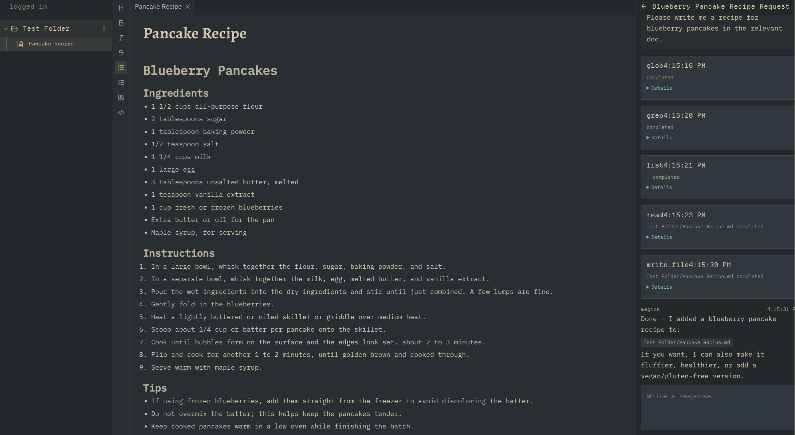

# Magick



Claude Code but for deep learning and thinking. Still a VERY EARLY WIP. Currently only runs via Codex.

## Todo
- Support for reasoning moodes and models.
- Agent that actually works well
- Cleaninng up the code
- 

## Running

```bash
npm run dev
```

Starts the default local development flow from the repo root.

```bash
bun run desktop:dev
```

Starts the Vite renderer and Electron desktop app together for development.

```bash
bun run desktop:start
```

Starts the Electron desktop app directly.

```bash
bun run desktop:main
```

Starts the Electron main process with file watching for `apps/desktop/src/main` and `apps/desktop/src/preload`.

```bash
bun run web:dev
```

Starts only the renderer on `http://localhost:4173`.

```bash
bun run server:start
```

Starts the local backend server on `ws://127.0.0.1:8787`.
